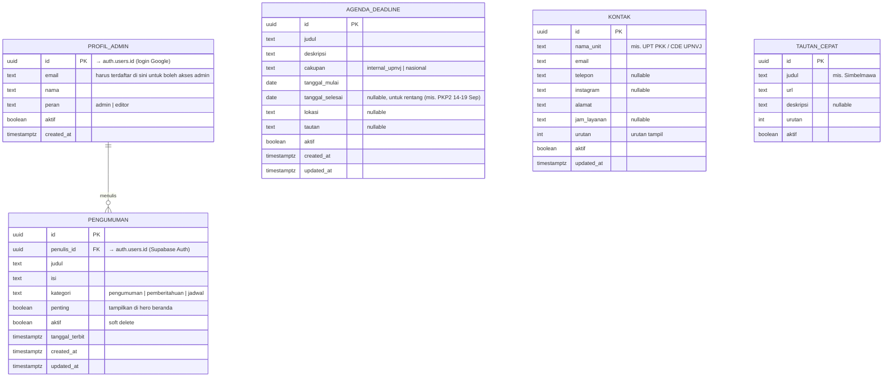

# ERD, Skema Database Website PKM UPNVJ

> Turunan dari [[PRD]] (Keputusan Implementasi #3, #5). Sumber kebenaran tetap PRD.
> Database: **Supabase (PostgreSQL)**, hanya menyimpan **konten dinamis** (Keputusan Q10).
> Konten panduan (10 bidang, tema, alur, FAQ) **tidak** ada di database, berupa file data statis.
> Tanggal: 2026-09-10.

## Diagram

## Catatan Desain

1. **`PROFIL_ADMIN` membatasi siapa boleh login admin.** Login Google lewat Supabase Auth membuat entri di `auth.users`; seseorang hanya bisa masuk panel admin jika emailnya terdaftar dan `aktif = true` di `PROFIL_ADMIN` (Keputusan Q9: ganti pengurus = ganti daftar email, tanpa ganti kode).
2. **`aktif` (soft delete)** di semua tabel konten, pengelola tidak bisa menghapus permanen secara tak sengaja; data historis tetap ada.
3. **`cakupan` di AGENDA_DEADLINE** memisahkan jadwal internal UPNVJ vs jadwal nasional, mendukung kebutuhan halaman Alur menampilkan keduanya berbeda gaya (nasional = resmi terverifikasi, internal = menunggu konfirmasi CDE).
4. **Row Level Security (RLS):** tabel konten dapat dibaca publik (anon) hanya baris `aktif = true`; tulis/hapus hanya oleh pengguna terautentikasi yang ada di `PROFIL_ADMIN aktif`.
5. **Timestamps** (`created_at`/`updated_at`) otomatis via trigger Postgres.
6. Tidak ada tabel untuk konten panduan/PDF, itu statis di kode (Keputusan #5 PRD); tidak ada tabel media, PDF panduan di-host sebagai file statis di `public/`.
